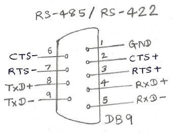
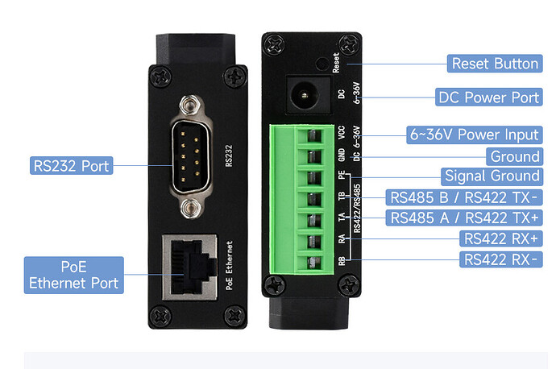
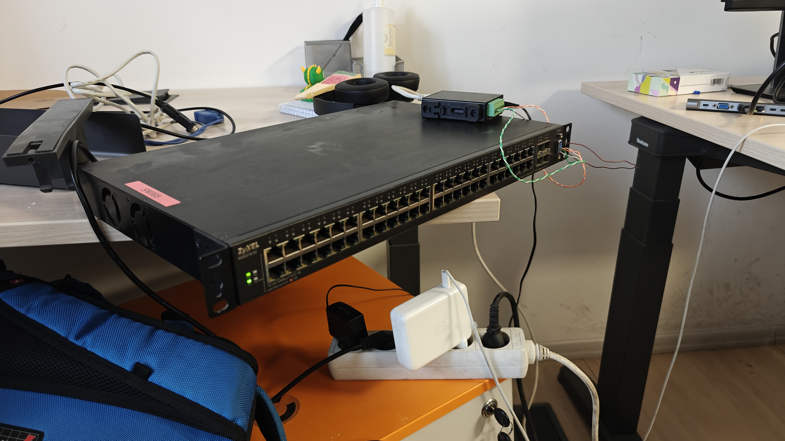
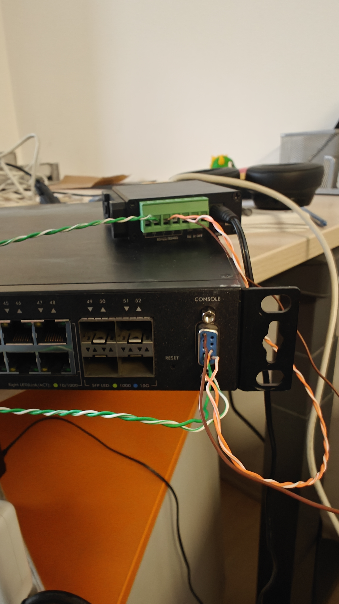

# Waveshare RS232/422/485 to Ethernet Converter Experiment

Validating a serial-to-Ethernet bridge for integrating legacy RS-232 laboratory equipment with a modern web-based Laboratory Information System (LIS).

## Overview

One of our laboratory analyzers, a **Mini VIDAS**, communicates exclusively over **RS-232**. Our existing Laboratory Information System (LIS), however, is a web application built with **Kotlin** and **Angular**, requiring a network-based interface instead of a direct serial connection.

The goal of this experiment was to evaluate whether a **Waveshare RS232/422/485 to ETH (B)** converter could reliably expose the analyzer's serial interface over TCP, allowing seamless integration with the existing infrastructure.

To validate the solution, I designed and performed a series of incremental tests, verifying each component independently before attempting the final integration with the laboratory analyzer. The networking equipment used during testing was provided by our IT team.

---

# Hardware

| Device                             | Purpose                                        |
| ---------------------------------- | ---------------------------------------------- |
| Mini VIDAS                         | Target laboratory analyzer                     |
| Waveshare RS232/422/485 to ETH (B) | Serial-to-Ethernet converter                   |
| MikroTik Ethernet Serial Console   | Initial validation of the converter            |
| MikroTik Switch                    | Network connectivity                           |
| Zyxel XGS2210-52                   | Serial output generator for TCP Client testing |
| CAT5e cable                        | Temporary wiring fabricated for testing        |
| macOS workstation                  | Test machine                                   |

---

# Step 1 – Validate the Waveshare Converter

Before involving the laboratory analyzer, I first wanted to verify that the Waveshare converter functioned correctly.

The IT team provided a **MikroTik switch** and a **MikroTik Ethernet Serial Console** for testing. I connected the Waveshare converter to the switch, attached the serial console to its RS-232 interface, and left the converter in its factory-default configuration:

* **Mode:** TCP Server

Using my macOS workstation, I established a TCP connection to the converter and successfully interacted with the MikroTik serial console over the network.

```text
macOS
    │
 TCP Connection
    │
 Ethernet
    │
Waveshare (TCP Server)
    │
 RS-232
    │
MikroTik Ethernet Serial Console
```

This initial test confirmed Ethernet connectivity, TCP communication, correct serial wiring, and proper operation of the Waveshare converter.

---

# Step 2 – Preparing for TCP Client Mode

The Mini VIDAS analyzer sends data asynchronously whenever results become available, making **TCP Client** mode the appropriate operating mode for the converter.

Since the analyzer was not immediately available for testing, I looked for another device capable of producing unsolicited serial output.

The IT team provided a **Zyxel XGS2210-52** managed switch, whose RS-232 management console continuously emits serial output, making it an excellent substitute for validating the converter in TCP Client mode.

---

# Step 3 – Improvised Wiring

A compatible serial cable was not available, so I improvised one using approximately **30 cm of CAT5e cable**.

After stripping the cable, I manually connected the individual conductors between the Zyxel switch's RS-232 interface and the Waveshare RS-422 terminal block according to the required signal mapping.

Although intended only as a temporary solution, the improvised wiring proved reliable enough to complete the experiment successfully.

## Wiring

| CAT5e Conductor | RS-232 DB9 Pin | Connected to Waveshare |
| --------------- | -------------- | ---------------------- |
| Brown           | 1 (GND)        | GND                    |
| Orange          | 4              | RX+                    |
| Orange/White    | 5              | RX−                    |
| Green           | 8              | TX+                    |
| Green/White     | 9              | TX−                    |

Reference:



Waveshare reference:


The wiring:



---

# Step 4 – TCP Client Validation

After verifying the physical wiring, I reconfigured the Waveshare converter to operate in **TCP Client** mode.

My macOS workstation acted as the TCP server, listening for incoming connections from the converter.

To receive incoming connections, I used:

```bash
socat -v TCP-LISTEN:4196,reuseaddr,fork STDIO
```

Alternatively:

```bash
nc -lk 4196
```

To observe the network traffic, I used:

```bash
sudo tcpdump -ni en7 port 4196
```

For payload inspection:

```bash
sudo tcpdump -X -ni en7 host 10.69.0.58 and port 4196
```

The Zyxel serial console output was successfully forwarded over Ethernet to the listening TCP socket, demonstrating that the converter correctly encapsulated serial communication inside TCP packets while operating in TCP Client mode.

---

# Results

The experiment successfully validated the Waveshare converter in both TCP Server and TCP Client modes.

The improvised CAT5e wiring provided a functional temporary connection between the Zyxel switch and the converter, allowing the complete communication path to be tested without waiting for a dedicated serial cable.

The successful transmission of unsolicited serial output over TCP confirmed that the converter is suitable for integrating legacy RS-232 laboratory equipment with a modern network-based Laboratory Information System.

---

# Lessons Learned

Performing the validation incrementally made troubleshooting significantly easier, as each stage could be verified independently before introducing additional variables.

The Waveshare converter operated reliably in both TCP Server and TCP Client modes. `socat` proved to be an excellent lightweight TCP endpoint for testing, while `tcpdump` provided immediate visibility into both connection behavior and application payloads.

Finally, although temporary wiring should never replace a proper production cable, fabricating a short CAT5e adapter proved to be a practical solution for rapidly validating hardware interoperability during development.

